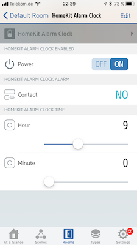

# Alarm clock

This provides a programmable timer for HomeKit. Unlike the HomeKit built in timers, this one can be reprogrammed by
rules. Another reason that I prefer this to the HomeKit builtin timers is that the rules that watch the Alarm state
can actually mention conditions and aren't necessarily blindly executed everytime the schedule expires.

## Appearance

The alarm clock provides an on/off toggle switch, a contact sensor to indicate the alarm and the hour/minute provided as
sliders to control the schedule on a 24h clock.



(Screenshot: Elgato Eve)

## Configuration

```json
{
  "bridge": {
      ...
  },
  "platforms": [
    {
      "platform": "AutomationSwitches",
      "switches": [
        {
          "type": "alarmclock",
          "name": "Alarm clock",
          "stored": true,
          "hour": 9,
          "minute": 0,
          "enabled": true
        }
      ]
    }
  ]
}
```

The above example creates an alarm clock, which by default closes the contact sensor every day at 09:00 (in the morning.)

## Options

| Field | Required | Description |
|---|---|---|
| type | Yes | Set this to ```alarmclock``` to make this entry an alarm clock. |
| name | Yes | Set this to the name of the alarm clock as you want it to appear in HomeKit apps. |
| stored | No | Set this to true if you want the switch to retain its settings across restarts. The default setting for the ```alarmclock``` type is  ```false```. |
| hour | Yes | The hour to trigger the alarm by default at. A value between 0 and 23. |
| minute | Yes | The minute to trigger the alarm by default at. A value between 0 and 59. |
| enabled | Yes | The default enabled state of the alarm. |

The defaults are only used if the stored state is unavailable.

## Beware of clocks, timezones and drift

The alarm clock depends upon proper timezone configuration for the alarm to fire at the right time. The sliders configure the 
time in your local time. Upon startup lines similar to the following are written to the log:

```text
[2018-2-20 11:50:17] [AutomationSwitches] Timezone is Europe/Berlin
[2018-2-20 11:50:17] [AutomationSwitches] Local time is 2018-2-20 11:50:17
[2018-2-20 11:50:17] [AutomationSwitches] UTC time is Tue, 20 Feb 2018 10:50:17 GMT
```

The local time line and the timezone line are important to ensure that the alarms fire of at the right time. Verify that your
timezone is set up correctly and the local time logged matches the actual local wall clock time.

* [Configure the timezone on Linux](https://unix.stackexchange.com/questions/110522/timezone-setting-in-linux)

> Node.js and this plugin depends upon the TZ environment variable being set properly.

Additionally it is recommended to ensure that NTP is working properly and that your device syncs with an NTP server 
frequently enough to compensate for [clock drift](https://en.wikipedia.org/wiki/Clock_drift). Ensure that either [systemd timesyncd](https://wiki.archlinux.org/index.php/systemd-timesyncd) 
is running or [setup an NTP client](http://raspberrypi.tomasgreno.cz/ntp-client-and-server.html).

## Usage

The contact sensor of the above alarm clock is closed every day at 09:00. Attach a HomeKit rule to the contact sensor to
execute any actions as you wish and apply conditions to the rule if needed.

## A real alarm clock example

One could create a real alarm clock in combination with the automation switches:

```json
{
  "bridge": {
      ...
  },
  "platforms": [
    {
      "platform": "AutomationSwitches",
      "switches": [
        {
          "type": "alarmclock",
          "name": "Alarm clock",
          "stored": true,
          "hour": 9,
          "minute": 0,
          "enabled": true
        },
        {
          "type": "automation",
          "name": "Snooze",
          "period": 300,
          "autoOff": false
        }
      ]
    },
    {
      "platform": "DACP",
      "devices": [
        {
          "name": "iTunes",
          "playlists": [
            "Wake up"
          ]
        }
      ]
    }
  ]
}
```

The above configuration creates an alarm clock that expires at 09:00 everyday. And adds iTunes to the mix via the [homebridge-dacp](https://npmjs.org/packages/homebridge-dacp) with a Wakeup playlist.

The following rule causes the playlist to be started every day at 09:00 and also starts the snooze timer.

```text
If Alarm clock contact is closed
Enable Snooze
Enable wake up playlist
```

And the snooze timer rule causes the playlist to start over again after the snooze period of 5 minutes has expired:

```text
If Snooze is detected
Enable wake up playlist
```
