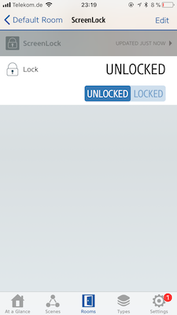

# Lock mechanism

This switch type represents a lock. A lock can be locked or unlocked and changing the state of the lock triggers built-in HomeKit notifications. Use it for things that can best be simulated by a lock.

## Appearance

The lock mechanism only provides means to lock/unlock via specifically labelled buttons.



(Screenshot: Elgato Eve)

## Configuration

```json
{
  "bridge": {
      ...
  },
  "platforms": [
    {
      "platform": "AutomationSwitches",
      "switches": [
        {
          "type": "lock",
          "name": "My simulated door lock",
          "default": "unlocked",
          "stored": false
        }
      ]
    }
  ]
}
```

## Options

| Field | Required | Description |
|---|---|---|
| type | Yes | Set this to ```lock``` to make this entry a lock mechanism. |
| name | Yes | Set this to the name of the lock as you want it to appear in HomeKit apps. |
| default | No | This configures the default state of the lock if it is not yet stored, never stored or the storage has become faulty. Set this to ```unlocked``` or ```locked``` depending on your needs. By default a lock is ```unlocked``` if this is not specified. |
| stored | No | Set this to true if you want the lock to retain its locked/unlocked state across restarts. The default setting for the ```lock``` type is  ```false```. |

See [configuration](Configuration.md) for more advanced configuration examples.

## Usage

This type is best used to simulate a physical lock or things that are best described by a lock. An example use case for the lock is in conditions for HomeKit rules and thus use it to enable or disable the rules based on other conditions.

## HomeKit Notifications

HomeKit, by default, enables notifications for lock mechanisms. Once enabled you automatically get built-in notifications for this lock too. You can disable these notifications in the Home.app if you do not care for the notifications. To disable/enable the notifications, open the Home app, select the tile that represents the lock and long-press on it, choose Details and scroll down until you get to Notifications. You can disable them there.

There's unfortunately no way to change the notification text in HomeKit. If you're looking for something to send customized notifications I'd recommend one of the [IFTT plugins](https://www.npmjs.com/search?q=homebridge+ifttt) or my [homebridge-telegram](https://www.npmjs.com/packages/homebridge-telegram) plugin (shameless plug.)
